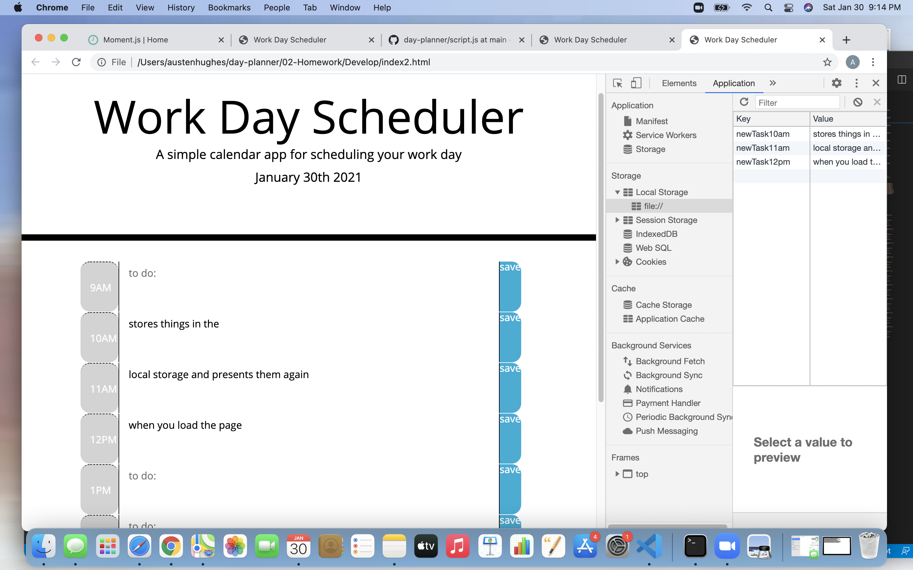

# Day Planner 

this is a basic workday planner:

- the current day will load as part of the header
- the hours run between 9am and 5pm
- down the left side you will find time markers that change color depending wether it is a past present or future hour. 
- you can save tasks in each individual time slot using the save button found on the right side of the row
- if you reload the page your saved tasks will load up again from your computers local storage 
- you can overwrite or delete task simply by overwriting or deleting and hitting the save button

this program uses bootstrap and moments.js 

here is a link to the workday planner : https://austenhughes.github.io/day-planner/.

here is a picture of the planner in action : 
